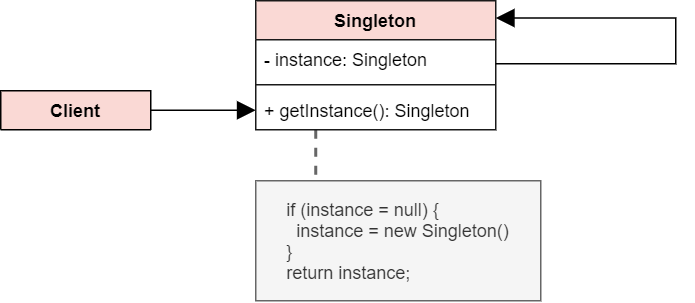

# Singleton Pattern

## Intent
The Singleton Pattern ensures a class has **only one instance**, and provides a global point of access to it.

## Structure

## Structure code
[Singleton pattern](./singleton.ts)

## Examples
[Login form](./examples/loginForm.html), `Store` in `vuex` and `redux`

