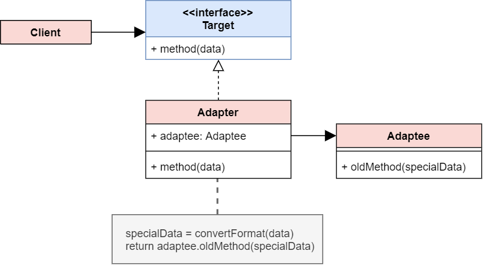

# Adapter Pattern

## Structure

## Structure code
[Adapter Pattern](./adapter.ts)

## Intent
The Adapter Pattern Converts the interface of a class into another interface the clients expect

## Examples
[Convert data format](./examples/convertDataFormat.ts),  [Axios adapts XMLHttpRequest](https://github.com/axios/axios/blob/hotfix/0.21.1/lib/adapters/xhr.js)

