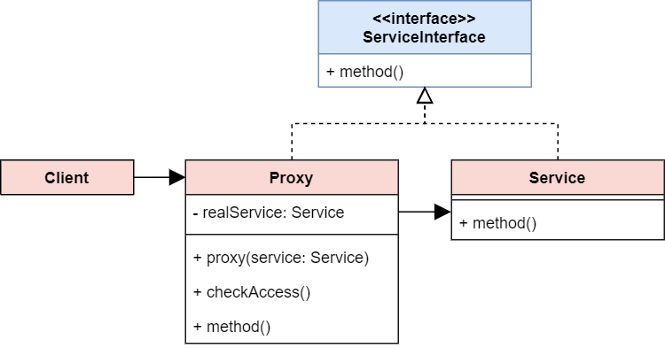

# Proxy Pattern
## Intent
The Proxy Pattern provides a surrogate object for another object and controls access to this other object

## Structure


## Structure code
```typescript
interface ServiceInterface {
  method(): void;
}

class RealService implements ServiceInterface {
  method() {}
}

class ProxyService implements ServiceInterface {
  constructor(private realService: ServiceInterface) {}

  checkAccess(): boolean {
    console.log(`Proxy: Checking access prior`);
    return true;
  }

  method() {
    if (this.checkAccess()) {
      this.realService.method();
    }
  }
}

// Client code
function client(service: ServiceInterface) {
  service.method();
  // ...
}

// Client can operate real service, but for some reason, we can't get access it directly
const realService = new RealService();
client(realService);

// Now we can use proxy service to get access to real service
const proxyService = new ProxyService(realService);
client(realService);
```

## Examples
[Event delegation](https://javascript.info/event-delegation), ES6 Proxy(To be learned)

## Relations
Adapter: provides a new interface to the wrapped object
Proxy: Provides the same interface with full access/function to the wrapped object
Decorator: provides an enhanced interface to the wrapped object
